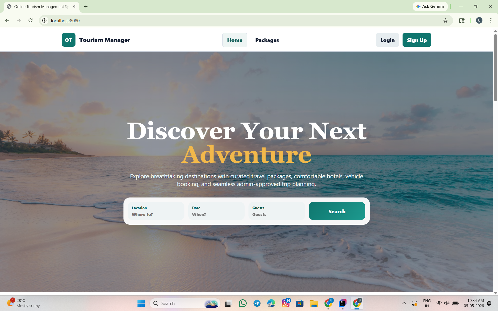

# Online Tourism Management System

A full-stack tourism booking application built with **Spring Boot**, **MySQL**, **Spring Security JWT**, and a responsive **React/HTML/CSS frontend** served directly from Spring Boot.

The system allows customers to explore travel packages, submit detailed booking requests, choose hotels and vehicles, and view destination maps after admin approval. Admins can manage packages, review orders, and approve or cancel bookings from a dashboard.

## Features

### Customer

- Register and login securely
- Browse tour packages with images
- Search packages by keyword, destination, price, and duration
- Submit booking requests with:
  - Current location
  - Number of travelers
  - Selected hotel
  - Selected vehicle
  - Extra notes
- View booking history
- See booking status: `PENDING`, `CONFIRMED`, or `CANCELLED`
- View tour location map after admin approval

### Admin

- Secure admin login
- Dashboard with system counts
- Add new tour packages with image URL
- View hotels, vehicles, and package inventory
- View complete customer order details
- Approve or cancel booking requests

### Frontend

- Landing page with hero section and search box
- Login and signup pages
- Customer dashboard
- Admin dashboard
- Package cards with images
- Featured hotels section
- Responsive footer

## Tech Stack

| Layer | Technology |
| --- | --- |
| Backend | Spring Boot 3 |
| Security | Spring Security + JWT |
| Database | MySQL |
| ORM | Spring Data JPA / Hibernate |
| Frontend | React CDN, HTML, CSS, JavaScript |
| Build Tool | Maven |
| Server | Embedded Tomcat |
| Testing | JUnit + Spring Boot Test + H2 test database |

## Architecture

```text
Frontend
  |
  v
REST Controllers
  |
  v
Service Layer
  |
  v
Repository Layer
  |
  v
MySQL Database
```

## Project Structure

```text
online-tourism-management-system-spring-boot/
|-- pom.xml
|-- README.md
|-- src/
    |-- main/
    |   |-- java/com/tourism/
    |   |   |-- config/
    |   |   |-- controller/
    |   |   |-- dto/
    |   |   |-- model/
    |   |   |-- repository/
    |   |   |-- security/
    |   |   |-- service/
    |   |   `-- TourismApplication.java
    |   `-- resources/
    |       |-- application.properties
    |       |-- db/schema.sql
    |       `-- static/
    |           |-- index.html
    |           |-- app.js
    |           `-- styles.css
    `-- test/
```

## Database Tables

- `users`
- `packages`
- `hotels`
- `rooms`
- `vehicles`
- `food_services`
- `transport`
- `bookings`
- `payments`

The SQL schema is available at:

```text
src/main/resources/db/schema.sql
```

## Requirements

Install these before running the project:

- Java 17 or higher
- Maven
- MySQL Server
- IntelliJ IDEA / VS Code / Eclipse

## Setup Instructions

### 1. Clone the repository

```bash
git clone https://github.com/YOUR_USERNAME/online-tourism-management-system-spring-boot.git
cd online-tourism-management-system-spring-boot
```

### 2. Configure MySQL

Open:

```text
src/main/resources/application.properties
```

Update your MySQL username and password:

```properties
spring.datasource.username=root
spring.datasource.password=your_mysql_password
```

The app can create the database automatically because the JDBC URL includes:

```properties
createDatabaseIfNotExist=true
```

Default database name:

```text
tourism_db
```

### 3. Run the project

Using Maven:

```bash
mvn spring-boot:run
```

Or from IntelliJ:

1. Open the project folder.
2. Wait for Maven dependencies to load.
3. Open `TourismApplication.java`.
4. Click the green Run button.

### 4. Open the application

```text
http://localhost:8080
```

## Default Admin Login

The application seeds one admin account on startup:

```text
Email: admin@tourism.com
Password: admin123
```

## Main API Endpoints

### Authentication

| Method | Endpoint | Description |
| --- | --- | --- |
| POST | `/api/auth/register` | Register user |
| POST | `/api/auth/login` | Login and receive JWT |

### Packages

| Method | Endpoint | Description |
| --- | --- | --- |
| GET | `/api/packages` | Get all packages |
| POST | `/api/packages` | Add package, admin only |
| PUT | `/api/packages/{id}` | Update package, admin only |
| DELETE | `/api/packages/{id}` | Delete package, admin only |

### Hotels and Vehicles

| Method | Endpoint | Description |
| --- | --- | --- |
| GET | `/api/hotels` | Get hotels |
| POST | `/api/hotels` | Add hotel, admin only |
| GET | `/api/vehicles` | Get vehicles |
| POST | `/api/vehicles` | Add vehicle, admin only |

### Bookings

| Method | Endpoint | Description |
| --- | --- | --- |
| POST | `/api/bookings` | Submit booking request |
| GET | `/api/bookings/user/{id}` | Get user bookings |
| GET | `/api/bookings` | Get all bookings, admin only |
| PUT | `/api/bookings/{id}/status` | Approve/cancel booking, admin only |

### Admin

| Method | Endpoint | Description |
| --- | --- | --- |
| GET | `/api/admin/dashboard` | Dashboard counts |

## JWT Authorization

Protected endpoints require this header:

```text
Authorization: Bearer <jwt-token>
```

## Booking Workflow

```text
Customer Login
  -> Search Package
  -> Fill Booking Details
  -> Submit Booking
  -> Status: PENDING
  -> Admin Reviews Order
  -> Admin Approves
  -> Status: CONFIRMED
  -> Customer Can View Tour Map
```

## Screenshots

Add screenshots in a `screenshots/` folder and link them here.

Suggested screenshots:

```text
screenshots/landing-page.png
screenshots/package-search.png
screenshots/customer-dashboard.png
screenshots/admin-dashboard.png
screenshots/booking-approval.png
```

Example:

```md

```

## Testing

Run tests:

```bash
mvn test
```

The test configuration uses an H2 in-memory database, so tests do not require your local MySQL database.

## Future Enhancements

- Online payment integration
- Email and SMS booking notifications
- Review and rating system
- Admin reports export
- Separate React frontend project
- Cloud deployment on Render/AWS

## Project Status

This project is ready for college demo, GitHub submission, and further feature development.

## License

This project is for educational use.
